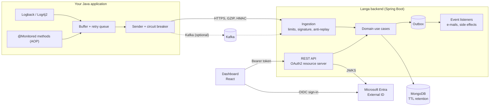

# Langa

**Lightweight log & metrics monitoring for Java applications — drop in an agent, see your logs and method timings in a dashboard.**

[](https://github.com/tonyadji/langa/actions/workflows/backend-ci.yml)
[](https://github.com/tonyadji/langa/actions/workflows/frontend-ci.yml)
[](https://central.sonatype.com/artifact/com.capricedumardi/langa-agent)


[](LICENSE)

> [!WARNING]
> **Work in progress.** Langa is a personal project under active development, not production software yet.
> The core flow works end to end (agent → ingestion → storage → dashboard); the path to a first MVP is
> described in the [roadmap](#roadmap-to-mvp).

---

## Contents

- [What it does](#what-it-does)
- [Architecture](#architecture)
- [Engineering highlights](#engineering-highlights)
- [Tech stack](#tech-stack)
- [Getting started](#getting-started)
- [Repository layout](#repository-layout)
- [Documentation](#documentation)
- [Roadmap to MVP](#roadmap-to-mvp)
- [Contributors](#contributors)
- [License](#license)

## What it does

1. **Collect** — the [Langa agent](agent/) is added to a Java application (as a `-javaagent` or a dependency).
   It captures Logback / Log4j2 logs and the execution time of `@Monitored` methods, batches them and
   ships them over HTTP (GZIP, HMAC-signed) or Kafka.
2. **Ingest & store** — the [backend](backend/) authenticates each batch, enforces payload and rate limits,
   stores entries in MongoDB with a per-application retention policy and tracks usage.
3. **Explore** — the [dashboard](frontend/) lets users create applications, browse and filter logs, chart
   metrics, follow storage usage, and share applications with other users or teams.

## Architecture



## Engineering highlights

What is worth a look if you are reviewing the code:

| Topic | Where |
|---|---|
| **Hexagonal architecture / DDD** — domain, use cases and ports independent of Spring and MongoDB; adapters in `infra` | [`backend/.../domain`](backend/src/main/java/com/langa/backend/domain), [`infra/adapters`](backend/src/main/java/com/langa/backend/infra/adapters) |
| **Domain events + outbox** — aggregates register events, stored in an outbox and dispatched by a poller | [`common/eda`](backend/src/main/java/com/langa/backend/common/eda), [`outbox/processors`](backend/src/main/java/com/langa/backend/infra/adapters/outbox/processors) |
| **Secure ingestion** — per-application HMAC signature, timestamp window and nonce store against replay, payload size and per-key rate limits (`413` / `429` + `Retry-After`) | [`IngestionSecurityImpl`](backend/src/main/java/com/langa/backend/infra/adapters/services/applications/IngestionSecurityImpl.java), [`rest/ingest/limits`](backend/src/main/java/com/langa/backend/infra/rest/ingest/limits) |
| **Provider-agnostic OIDC** — Entra today, Cognito/Keycloak by configuration; users linked by email on first sign-in | [`infra/security`](backend/src/main/java/com/langa/backend/infra/security), [docs/authentication.md](docs/authentication.md) |
| **Data retention** — MongoDB TTL indexes driven by a per-application retention policy | [`LogEntryDocument`](backend/src/main/java/com/langa/backend/infra/adapters/persistence/logentries/mongo/LogEntryDocument.java) |
| **Resilient agent** — bounded buffers, retry with exponential backoff, circuit breaker, GZIP, runtime control via JMX / Actuator, published on Maven Central | [`agent/`](agent/) |
| **Quality gates** — unit tests on every layer, JaCoCo coverage, PIT mutation testing, Qodana, CI on every push | [`.github/workflows`](.github/workflows) |

## Tech stack

| Component | Stack |
|---|---|
| **Agent** | Java 17, Log4j2 / Logback appenders, AspectJ & Spring AOP, Apache HttpClient, Kafka client, JMX |
| **Backend** | Java 21, Spring Boot 3.5 (Web, Security OAuth2 Resource Server, Data MongoDB, Kafka, Mail, Actuator), springdoc-openapi |
| **Dashboard** | React 19, TypeScript, Vite, Tailwind CSS 4, Recharts, MSAL, Vitest, Playwright, Storybook |
| **Infra** | Docker, GitHub Actions, Railway, Maven Central |

## Getting started

**Prerequisites:** Java 21, Maven 3.9+, Node.js 18+, a MongoDB instance, and a Microsoft Entra External ID
tenant for sign-in ([setup guide](docs/authentication.md#microsoft-entra-external-id-setup)).
Kafka is optional.

```bash
git clone https://github.com/tonyadji/langa.git
cd langa
```

**1. Backend** — configure the environment from [`backend/.env.example`](backend/.env.example), then:

```bash
cd backend
./mvnw spring-boot:run
```

**2. Dashboard**

```bash
cd frontend
cp .env.example .env.local   # set VITE_API_BASE_URL and the VITE_ENTRA_* values
npm install
npm run dev                  # http://localhost:5173
```

**3. Agent** — sign in to the dashboard, create an application, then start your own application with the
agent and the ingestion URL and secret shown for that application:

```bash
export LOGGING_FRAMEWORK=logback
export LANGA_INGESTION_URL=<ingestion URL from the dashboard>
export LANGA_INGESTION_SECRET=<application secret>
java -javaagent:langa-agent.jar -jar your-app.jar
```

> A one-command `docker compose up` with a sample application is the first item of the [roadmap](#roadmap-to-mvp).

## Repository layout

```text
langa/
├── agent/       Java agent published on Maven Central (collects and ships logs & metrics)
├── backend/     Spring Boot API: ingestion, applications, teams, users
├── frontend/    React dashboard
├── docs/        Cross-cutting docs: authentication, deployment
└── .github/     CI/CD workflows
```

## Documentation

| Document | Content |
|---|---|
| [Agent](agent/README.md) | Installation, configuration, log and metric collection |
| [Agent configuration guide](agent/src/main/resources/configuration-guide.md) | Every agent setting |
| [Backend](backend/README.md) | Architecture, local setup, tests |
| [Backend in depth](backend/documents/README.md) | Specification, tutorial, how-to guides, reference, design rationale |
| [Dashboard](frontend/README.md) | Features, setup, scripts |
| [Authentication](docs/authentication.md) | OIDC providers, Entra setup, dev tokens |
| [Deployment](docs/deployment.md) | Docker images, pipelines, production checklist |

## Roadmap to MVP

**Done** — agent on Maven Central (Logback, Log4j2, `@Monitored`, HTTP & Kafka senders, circuit breaker) ·
HMAC-secured ingestion with limits · applications, retention policies, usage tracking · sharing with users and
teams, e-mail invitations · OIDC sign-in (Entra) · dashboard for logs, metrics, usage, teams · CI and
containerised deployment.

| Milestone | Goal | Items |
|---|---|---|
| **M1 · Run it in 5 minutes** | Anyone can try Langa locally | Root `docker-compose.yml` (MongoDB, backend, dashboard, optional Kafka) · sample Spring Boot app instrumented with the agent · seeded demo data · local auth mode that does not need an Entra tenant |
| **M2 · Correctness at scale** | Safe with several backend instances and concurrent agents | Real transactional outbox (Mongo transaction manager, or write events in the aggregate document) · distributed lock on the outbox poller (ShedLock) · atomic usage counters (`$inc`) · HMAC signature covering the request body · distributed rate limiting (Bucket4j + Redis) · configurable Kafka topic (currently fixed to `langa`) · remove the last domain → infra dependency and enforce layering with ArchUnit |
| **M3 · Test pyramid** | Confidence beyond unit tests | Testcontainers integration tests (MongoDB, Kafka) · end-to-end test agent → backend · Playwright smoke tests on the dashboard · coverage reported in CI |
| **M4 · Product MVP** | Useful to a small team every day | Full-text log search · live tail (Server-Sent Events) · metric aggregation (p50 / p95 / error rate per method) · alert rules with e-mail / webhook notifications · retention and quotas per plan |
| **M5 · Operate it** | Run a public demo with confidence | Backend self-observability (Micrometer / Prometheus, OpenTelemetry traces) · public demo instance · Helm chart or one-click Railway template |

**Later** — OTLP ingestion (accept OpenTelemetry data), agents for other runtimes (Python, Node.js),
Cognito / Keycloak sign-in in the dashboard.

## Contributors

- **Tony Adji** ([@tonyadji](https://github.com/tonyadji)) — author and maintainer; agent, backend, architecture, CI/CD.
- **Alex Kouasseu** — dashboard (React frontend) co-author.

Contributions are welcome, see [CONTRIBUTING.md](CONTRIBUTING.md).

## License

[MIT](LICENSE)
