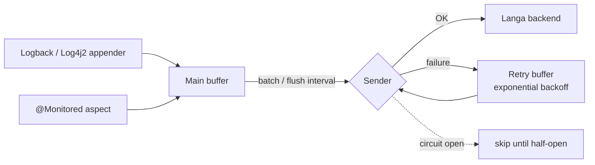

# Langa Agent

[](https://central.sonatype.com/artifact/com.capricedumardi/langa-agent)

[](LICENSE)

A lightweight Java agent that collects **logs** (Logback, Log4j2) and **method timings** (`@Monitored`) from
your application and ships them to a [Langa](../README.md) backend — without blocking your threads.

> [!NOTE]
> Milestone releases (`0.0.x-Mx`): the API may still change. See the [changelog](CHANGELOG.md).

## Contents

- [Features](#features)
- [Installation](#installation)
- [Quick start](#quick-start)
- [Collecting logs](#collecting-logs)
- [Collecting metrics](#collecting-metrics)
- [Configuration](#configuration)
- [Runtime monitoring](#runtime-monitoring)
- [How it works](#how-it-works)
- [Development](#development)

## Features

| | |
|---|---|
| **Logs** | Logback and Log4j2 appenders, bound automatically when the agent starts |
| **Metrics** | Execution time and outcome of `@Monitored` methods, via AspectJ or Spring AOP |
| **Transport** | HTTP (optional GZIP, HMAC-signed requests) or Kafka (async) |
| **Non-blocking** | Bounded in-memory buffers, batching, background flush |
| **Resilience** | Retry queue with exponential backoff, circuit breaker when the backend is down |
| **Configuration** | System properties > environment variables > properties file > defaults, validated at startup |
| **Observability** | JMX MBeans and Spring Boot Actuator endpoints; some settings can be changed at runtime |

## Installation

Use the latest version shown by the Maven Central badge above.

**Maven**

```xml
<dependency>
    <groupId>com.capricedumardi</groupId>
    <artifactId>langa-agent</artifactId>
    <version>${langa-agent.version}</version>
</dependency>
```

**Gradle**

```groovy
implementation "com.capricedumardi:langa-agent:${langaAgentVersion}"
```

## Quick start

1. In the Langa dashboard, create an application and copy its **ingestion URL** and **secret**.
2. Start your application with the agent:

```bash
export LOGGING_FRAMEWORK=logback            # or log4j2
export LANGA_INGESTION_URL=<ingestion URL>
export LANGA_INGESTION_SECRET=<application secret>

java -javaagent:langa-agent.jar -jar your-application.jar
```

The agent fails fast with an explicit message if a required setting is missing.

## Collecting logs

When started as a `-javaagent`, the agent attaches its appender to the root logger of the selected framework.
You can also declare it explicitly:

**Logback** (`logback.xml`)

```xml
<configuration>
    <appender name="LANGA" class="com.capricedumardi.agent.core.appenders.LangaLogbackAppender"/>
    <root level="INFO">
        <appender-ref ref="LANGA"/>
    </root>
</configuration>
```

**Log4j2** (`log4j2.xml`)

```xml
<Configuration>
    <Appenders>
        <LangaAppender name="LangaAppender"/>
    </Appenders>
    <Loggers>
        <Root level="info">
            <AppenderRef ref="LangaAppender"/>
        </Root>
    </Loggers>
</Configuration>
```

## Collecting metrics

Annotate the methods to measure. Without Spring, AspectJ load-time weaving is used (`META-INF/aop.xml`).
With Spring, register the `SpringMonitoringAspect` bean, e.g. by adding `com.capricedumardi.agent.core.aspects`
to your component scan.

```java
import com.capricedumardi.agent.core.metrics.Monitored;

@Service
public class OrderService {

    @Monitored
    public Order processOrder(Order order) {
        return orderRepository.save(order);   // duration and status are recorded
    }
}
```

## Configuration

Settings are resolved in this order (highest first):

1. System properties — `-Dlanga.buffer.batch.size=100`
2. Environment variables — `LANGA_BUFFER_BATCH_SIZE=100`
3. `langa-agent.properties` file
4. Built-in defaults

**Required**

| Variable | Description |
|---|---|
| `LOGGING_FRAMEWORK` | `logback`, `log4j2` or `none` |
| `LANGA_INGESTION_URL` | Ingestion URL of the application |
| `LANGA_INGESTION_SECRET` | Secret of the application (signs requests) |

**Most useful options**

| Property | Purpose |
|---|---|
| `langa.buffer.batch.size` · `langa.buffer.flush.interval.seconds` | Batch size and flush frequency |
| `langa.buffer.main.queue.capacity` · `langa.buffer.retry.queue.capacity` | Memory bounds |
| `langa.http.compression.enabled` · `langa.http.compression.threshold.bytes` | GZIP for large payloads |
| `langa.http.max.retry.attempts` | Retries with exponential backoff |
| `langa.circuit.breaker.failure.threshold` · `langa.circuit.breaker.open.duration.millis` | Circuit breaker |
| `langa.kafka.async.send` · `langa.kafka.compression.type` | Kafka sender |
| `langa.debug.mode` | Verbose agent output |

Every setting, with defaults and tuning profiles: **[configuration guide](src/main/resources/configuration-guide.md)**.

## Runtime monitoring

- **JMX** — MBeans exposing buffer statistics, circuit breaker state, success / failure rates, and
  dynamic configuration.
- **Spring Boot Actuator** — `/actuator/langaMetrics` (statistics) and `/actuator/langaConfig`
  (configuration), once exposed in `management.endpoints.web.exposure.include`.

Circuit breaker states: **CLOSED** (normal) → **OPEN** (too many failures, sends are skipped) →
**HALF_OPEN** (a trial send after the open duration).

## How it works



## Development

Requirements: Java 17+, Maven 3.8+.

```bash
mvn clean verify       # build + tests
mvn clean install      # install locally
```

Releases are published to Maven Central by the
[maven-publish](../.github/workflows/maven-publish.yml) workflow when a GitHub release is created.

## Links

[Changelog](CHANGELOG.md) · [Issues](https://github.com/tonyadji/langa/issues) · [Contributing](../CONTRIBUTING.md) · [License (MIT)](LICENSE)
